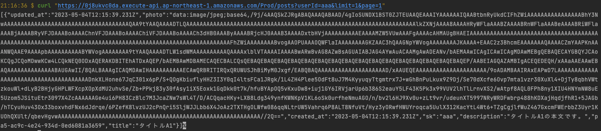

🌙 lambda-template
====


## 📗 プロジェクトの概要

AWS（API Gateway → Lambda → DynamoDB）を利用したCRUDのサンプルです。
投稿された記事データをAPI経由で取得・登録・変更・削除が出来ます。
SAM を利用して管理しているので、コマンドひとつでインフラを構築出来るようにしています。
また、Dockerを利用することでローカル環境でも実装・テストが出来るようにしています。

## 🌐 Demo



## 📦 ディレクトリ構造

```
.
├── README.md
├── app (Lambdaのモジュール)
│   ├── dist
│   ├── jest.config.ts
│   ├── node_modules
│   ├── package-lock.json
│   ├── package.json
│   ├── src
│   ├── tests
│   └── tsconfig.json
├── dc.sh (Docker管理用のシェルスクリプト)
├── docker
│   ├── awscli
│   ├── docker-compose.yml
│   └── dynamodb
├── layers (共通モジュール)
│   └── app-layer
├── samconfig.toml
├── schema
│   ├── data
│   └── posts.json
├── task
│   ├── env.json
│   └── env.json.example
└── template.yaml
```

## 🔧 開発環境の構築

IAM ユーザーを用意する
```
ユーザ名：「lambda-user」
アクセス権限：
「AdministratorAccess」
```

SAM CLI をインストールする
```
$ pip install aws-sam-cli
```

AWSにアクセスする為の設定を作成する
```
$ aws configure --profile lambda-user 
AWS Access Key ID [None]: xxxxxxxxxx
AWS Secret Access Key [None]: xxxxxxxxxx
Default region name [None]: ap-northeast-1
Default output format [None]: json
```

## 🖊️ Docker 操作用シェルスクリプトの使い方

```
Usage:
  dc.sh [command] [<options>]

Options:
  stats|st                 Dockerコンテナの状態を表示します。
  init                     Dockerコンテナ・イメージ・生成ファイルの状態を初期化します。
  start                    すべてのDaemonを起動します。
  stop                     すべてのDaemonを停止します。
  --version, -v     バージョンを表示します。
  --help, -h        ヘルプを表示します。
```

## 💬 使い方

ローカルでAPIを起動する
```
# 事前準備
$ ./dc.sh init
$ docker network create lambda-local

# Dockerを起動する
$ ./dc.sh start

# DynamoDBにテーブルを作成する
$ ./dc.sh aws local
> aws dynamodb create-table --cli-input-json file://schema/posts.json --endpoint-url http://dynamodb:8000  --billing-mode PAY_PER_REQUEST
> aws dynamodb list-tables  --endpoint-url http://dynamodb:8000 

(テーブルを削除する場合)
> aws dynamodb delete-table --table-name lambda_template_posts --endpoint-url http://dynamodb:8000

# ESModuleでビルドできるようにする
$ npm install -g esbuild 
# SAMでアプリをビルドしてからAPIを起動する
$ sam build
$ sam local start-api --env-vars task/env.json --docker-network lambda-local

# 一覧取得
$ curl http://127.0.0.1:3000/posts
$ curl "http://127.0.0.1:3000/posts?limit=3&page=2"
$ curl "http://127.0.0.1:3000/posts?userId=aaa"
# 登録
$ curl -X POST -H "Content-Type: application/json" -d @schema/data/post.json http://127.0.0.1:3000/posts
# 単一取得
$ curl http://127.0.0.1:3000/posts/49e3de26-f28b-4140-becf-06d8b3279914/
# 更新
$ curl -X PUT -H "Content-Type: application/json" -d @schema/data/post.json http://localhost:3000/posts/49e3de26-f28b-4140-becf-06d8b3279914/
# 削除
$ curl -X DELETE http://127.0.0.1:3000/posts/49e3de26-f28b-4140-becf-06d8b3279914/
```

本番環境（AWS） にデプロイする
```
# ビルドを実行する（.aws-samディレクトリに生成される）
$ sam build
# AWSに反映する
$ sam deploy --config-env stg

# AWSから、DynamoDB、Lambda&APIGatewayを削除する
$ sam delete --stack-name lambda-template --profile lambda-user
```

### DynamoDBAdmin
DynamoDBに接続してデータの参照や編集が可能です。
Dockerを起動後に以下のURLにアクセスすると利用可能です。

http://localhost:8001/


## 🎨 参考

| プロジェクト| 概要|
| :---------------------------------------| :-------------------------------|
| [AWS SAM CLI 再入門 2021.08](https://qiita.com/hayao_k/items/7827c3778a23c514e196)| AWS SAM CLI 再入門 2021.08|
| [aws-sam-cliでLambda,DynamoDBのサーバーレスアプリケーション開発に入門してみる](https://qiita.com/umeneri/items/6fb3f7560f4a878f6dfd)| aws-sam-cliでLambda,DynamoDBのサーバーレスアプリケーション開発に入門してみる |
| [Lambda Layers をnode.js(SAM)で試してみる](https://qiita.com/monamu/items/96d63dd2151a8ab7e6cf)| Lambda Layers をnode.js(SAM)で試してみる |
| [serverless-expressでAPI GatewayからLambdaを実行する](https://zenn.dev/yuta_saito/articles/8b543a1957c375593ee5)| serverless-expressでAPI GatewayからLambdaを実行する |


## 🎫 Licence

[MIT](https://github.com/isystk/lambda-template/blob/master/LICENSE)

## 👀 Author

[isystk](https://github.com/isystk)
